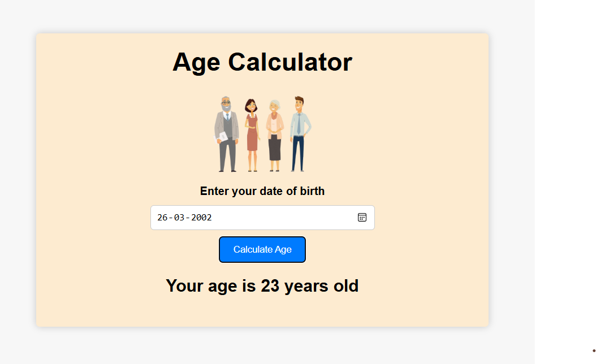
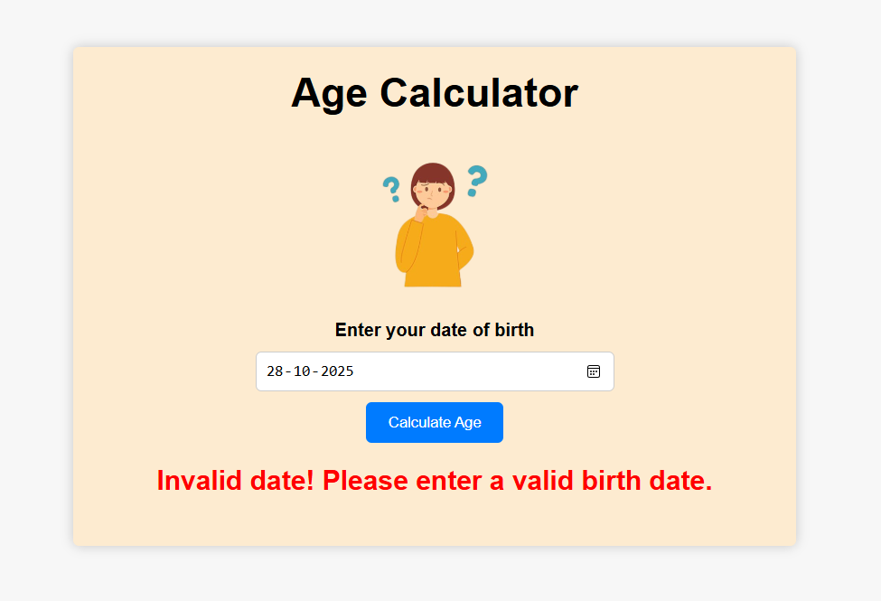

## Age Calculator

🧮 **Age Calculator**
-A simple and user-friendly web-based application that calculates a user's age based on their date of birth.
    
✨ **Features**
- Clean and attractive UI with soft colors and an illustration.
- Responsive and works smoothly on both desktop and mobile browsers.

🛠️ **Technologies Used**
 - HTML5 - Structure of the webpage
 - CSS3 - styling and layout design
 - JavaScript - logic to calculate the age

🚀 **How It Works**
 - User enters their date of birth in the input field.
 - on clicking "Calculate Age", JavaScript processes the date.
 - The calculated age (in years) is displayed below the button.

🖼️ **Screenshots**  

  
  

  ✅ <b>Valid Input Result</b> &nbsp;&nbsp;&nbsp; ⚠️ <b>Invalid Date Alert</b>

